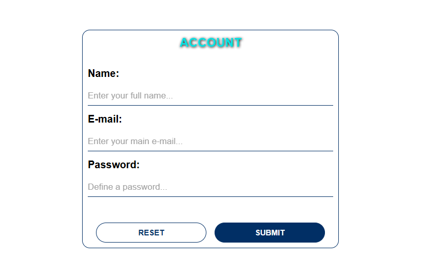

# Processo Seletivo | Integrale

## 📖 Sobre o Projeto

O projeto deste repositório se trata de uma página HTML simples, com alguns estilos CSS e eventos JavaScript.

## 📚 Estrutura da Página HTML

A página HTML contém um formulário de cadastro, que possui os seguintes campos:

- Name;

- Email;

- Password.

Ao final desse formulário, existem dois botões:

- Submit (Envio do formulário.);

- Reset (Redefinição do formulário.).

## ▶ Como Executar o Projeto

Existem três maneiras de visualizar este projeto em funcionamento:

- Baixe o conteúdo deste repositório como um arquivo .ZIP;

- Clone este repositório;

- Clique no link localizado abaixo da descrição deste repositório.

## 📝 Guia de Desenvolvimento

[Clique aqui](./GUIDE.md) para ver o guia de desenvolvimento do projeto deste respositório.

## 💻 Resultado Final

